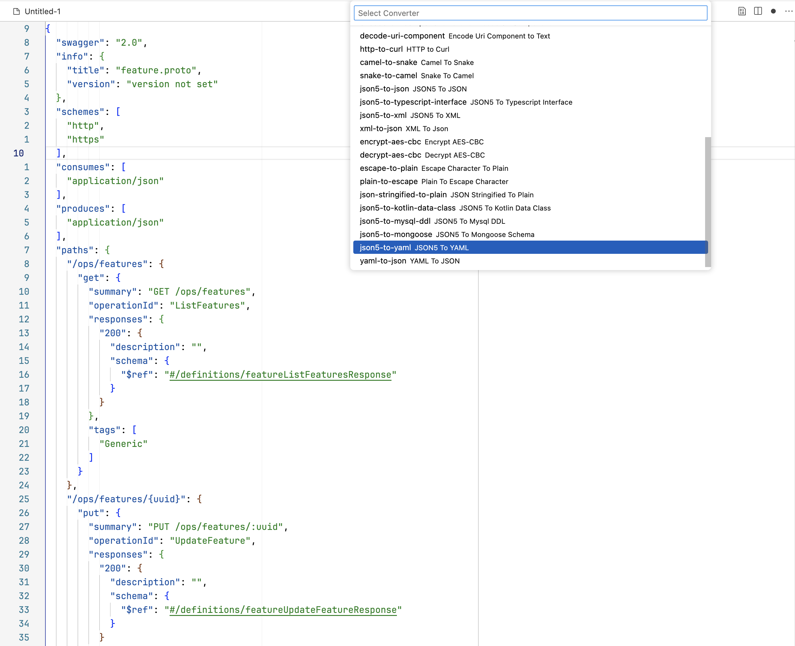

## Text Converter

***Text Converter Utils for development***

## Preview

## Available Features

* **Decode**
  * *Base64 To Plain Text*
  * *Hex To Plain Text*
  * *URL Encoded To Plain Text*
* **Encode**
  * *Plain Text To Base64*
  * *Plain Text To Hex*
  * *Plain Text To URL Encoded*
  * *Base64 To Hex*
  * *Hex To Base64*
* **Crypto**
  * *Encrypt AES-CBC*
  * *Decrypt AES-CBC*
* **Code Style**
  * *Camel Case To Snake Case*
  * *Snake Case To Camel Case*
* **Format**
  * *JSON Prettify*
  * *XML Prettify*
  * *Plain Text To Upper Case*
  * *Plain Text To Lower Case*
  * *JSON5 To JSON*
  * *JSON Stringified To Plain Text*
* **Hash**
  * *Plain Text To SHA256*
  * *Plain Text To SHA512*
* **Escape**
  * *Plain Text To Escaped*
  * *Escaped To Plain Text*
* **XML**
  * *XML To JSON*
  * *JSON5 To XML*
* **YAML**
  * *YAML To JSON*
  * *JSON5 To YAML*
* **TypeScript**
  * *JSON5 To Typescript Interface*
* **Kotlin**
  * *JSON5 To Kotlin Data Class*
* **Http**
  * *HTTP To Curl*
  * *JSON To form-url-encoded parameter*
  * *form-url-encoded parameter To JSON*
* **Database**
  * *JSON5 To Mysql DDL*
  * *JSON5 To Mongoose*
* **ETC**
  * *Mask yyyyMMdd*
## Shortcuts
* Text Convert
  * `command+shift+c`